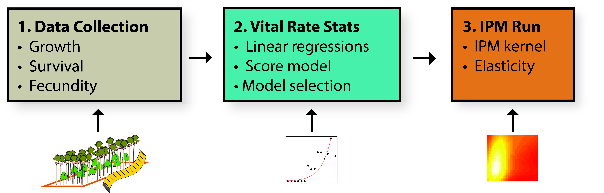
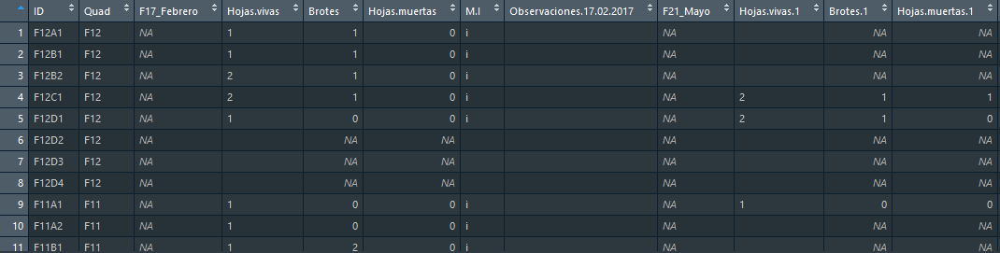
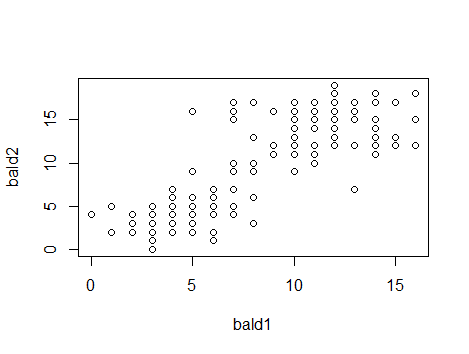
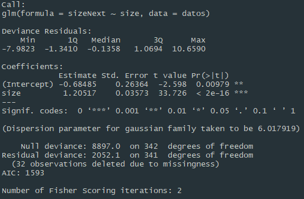
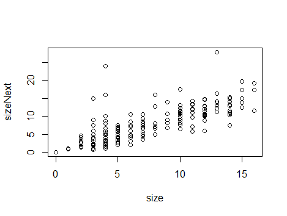
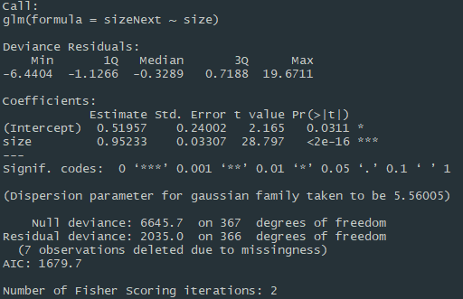
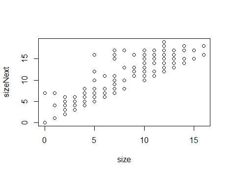
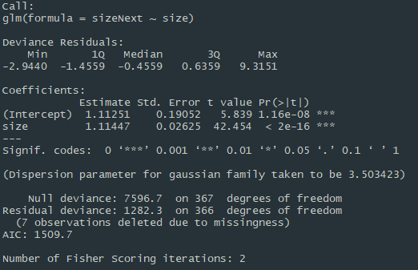

## Abstract

**TITLE:** Hyperkeystone Palm Species Demography: Preliminary Modelling of *Mauritia flexuosa* for Sustainable Harvest in Tena, Ecuador.  
**AUTHORS:** Tello, M. & Penhuela, M.C.  
**INTRODUCTION:**  
**OBJECTIVES:** Assess the model and further identification of the size ranges and processes that contribute the most to the population stability for management purposes.  
**METHODS:** For this, a 1-ha plot was established on a flooded forest dominated by *M.flexuosa* in the Napo river basin where 571 individuals were sampled for three years on a monthly basis.



This documents specifies R proccess for establishing growth function for building an IPM.

------

**Index**

[TOC]

***

For the IPM construction we need three functions: growth, survival and fecundity. In this section we will be determining the growth function through the analysis of the available data measuring our species growth. The data collected for this is mainly from number of leaves present . However, we consider two other options calculated from the first one. These are leaf production rate mean and maximum number of leaves. From these, generalized linear model are adjusted to data and the model with the best AIC score is chosen. 


## Vital Rate Stats


### **Getting started:**

#### *Libraries and directory*

The *dplyr* package offers an incredible level of manipulation of data. For our project, data was taken in a way that permits us use it for more than one purpose. This is way we have to arrange the data using *dplyr* for this specific methodology of IPM.

```R
setwd("C:/Users/LENOVO/Documents") # Folder with all the data needed.
library(dplyr) # Package for data arrangement.
```


#### *Raw data*

Needed data is available in two different sets. The first one, is phenological data collected each month  where number and state  (green, mature and dry) of inflorescences and infrutescences of all non-seedlings *M. flexuosa* individuals is registered. This data table also includes annual DBH measures of other trees species with a DBH > 10 cm, thus later in the code we need to exclude this species from the analysis.

```R
main_data <- read.csv2("MISAHUALLI_Morete_Dic_12_2018_MCP-IKIAM.csv")
sdlngs_data <- read.csv2("MISAHUALLI_Plántulas_25_11_18.csv")
view(main_data)
```


**Figure 1.**  Quick view of data and colums from non-seedlings *M. flexuosa* individuals and other plant species with a DBH >10 cm within the plot.

```R
view(sdlngs_data)
```



**Figure 2.** Quick view of data and columns from *M. flexuosa* seedlings individuals.


#### *Filter and arrangement*

As mentioned above, we only need a segment of the data. Starting with data from **Figure 1**, we first need to  exclude species that are not *M. flexuosa*. 

```R
data <- filter(main_data, Common_name == "Morete")
```

An additional column not explicitly considered in the survey template needs to be added. Survival is an important variable to have a check on while constructing the growth models, and later on for IPM consolidation. For this, we used the observation column where every death was registered and mutate into another dead/survive column.

```R
for(i in 1:375){ # In the range of the 375 individuals
  if(main_data$Notes_Enero_.2019[i]=="muerta"){ # Survey observation columns
    main_data$surv[i] <- 0 # When "muerta" survival is 0
  } else{
    main_data$surv[i] <- 1 # When not, survival is 1
  }
}
```


### **Model Construction**

#### Model Option 1: *Number of leaves present*

Raw data is filtered in order to extract only the segment of the data we are interested in. In this case we have filter only the objective species, a time period of three years, and assigned a column to determine if they have survived or not at this period of time. Then, we use *glm()* function to create the model. The independent variable is the number of leaves the individual started with at the beginning of the survey, and  the dependent variables is the number of leaves at the end of the survey.

##### *Data selection and calculation*

In order to work with the number of leaves present, and due to the input needed for the IPM, we only need the number of leaves at the end and the beginning. We choose these two columns using the *select()* function.

```R
main_data <- dplyr::select(datos,Hojas.Vivas,Hojas.Vivas.25,Notes_Enero_.2019)
size <- main_data$Hojas.Vivas
sizeNext <- main_data$Hojas.Vivas.25
colnames(main_data) <- c("size","sizeNext","surv")
plot(size,sizeNext)
```



##### *Model definition and score*

```R
m1 <- glm(sizeNext~size,data = main_data)
summary(m1)
```




#### Model Option 2: *Leaf production rate mean*

From the data used above, we calculated the rate at which leaves were being produced in every individual between every month. In this case, the independent variable is the initial number of leaves, and the dependent variable is the initian number of leaves times multiplied by leaf production average rate of that individual.

##### *Data selection and calculation*

For this model option, there is enough data for calculating production rate mean in adults. Therefore, we will exclude this category and determine survival with a reduced number of individuals.

```R
main_data <- filter(main_data, EstadioClass != "A")
for(i in 1:262){
  if(main_data$Notes_Febrero_.2018[i]=="muerta"){
    main_data$surv[i] <- 0
  } else{
    main_data$surv[i] <- 1
  }
}
```

However, we need not only end and final number of leaves, but all the monthly data available and calculate its rate and mean.

```R
main_data <- dplyr::select(main_data,ID,surv,contains("vivas"))
geo <- c()
for(i in 1:262){
  for(j in 1:25){
    prom = c()
    prom[i] <- main_data[i+1,j]/main_data[i,j]
    geo[i] <- prod(prom, na.rm = TRUE)
  }
}
main_data <- cbind(main_data,geo)
main_data <- dplyr::select(df,ID,surv,Hojas.Vivas,geo)
size <- main_data$Hojas.Vivas
sizeNext <- main_data$Hojas.Vivas * main_data$geo
plot(size,sizeNext)
```



##### *Model definition and score*

```R
m2 <- glm(sizeNext~size, data = dff)
summary(m2)
```




#### Model Option 3: *Maximum number of leaves*
The same process of data initial arrangement was executed. The maximum number was obtained from the number of leaves in each month for the dependent variable.

##### *Data selection and calculation*

For this model, we choose all the data of leaves for each month and determined the maximum for each row (individual) using the *max()* function.

```R
datos <- dplyr::select(datos,c(H,contains("vivas")))
maxim=c()
for(i in 1:375){
  for(j in 1:12){
    maxim[i] <- max(datos[i,],na.rm = TRUE)
  }
}
size <- datos$Hojas.Vivas
sizeNext <- maxim 
plot(size,sizeNext)
```



##### *Model definition and score*

```R
m3 <- glm(sizeNext~size)
summary(m3)
```


